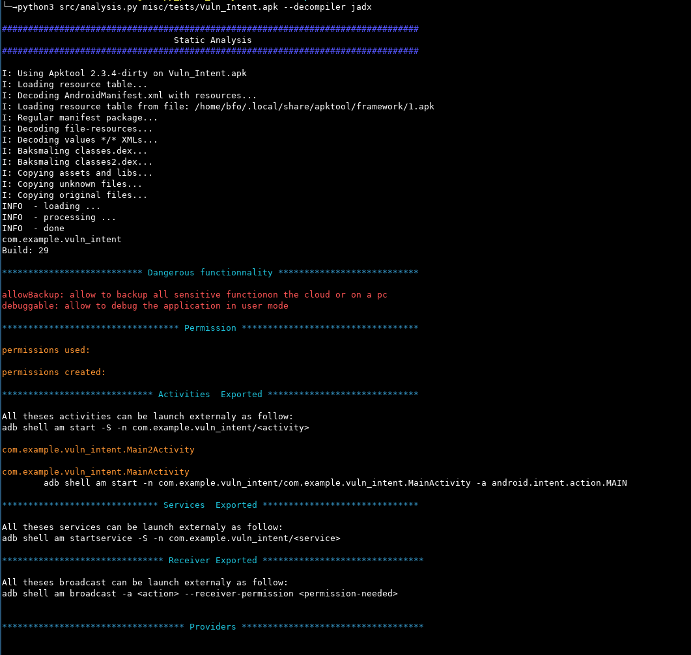

Static Mode
============

When the tool is launch without option only a quick analysis of the Manifest
is executed.
The tool enumerate:

.. hlist::

  - Dagerous functionnality
  - Permission used and created
  - Activities exported
  - Service exported
  - Broadcast receiver exported
  - Provider

Advanced
********

To analysed the source code af the APK and not only the manifest or the other
xml files. Option `--tree` can be used

This option allow the tool to browse all nodes of the AST build with the source
code and create some hook on each interesting node of the APK

.. code-block:: bash

  python3 src/analysis example.apk --tree --tree_path /com/

.. note::
  
  If you want to restrict analysis to a part of the code you should used option
  `--tree_path <path>` 

.. warning::
  Becareful when you used --tree_path if you don't put a / at is not seek the
  directory but the file begin by last word specify for instance /com seek file
  com and /com/ seek directory

.. asciinema:: tree_analysis.cast
  :preload:

Display AST
***********

To have a render of the ast browse you can call `--graph_ast` will produce a
pdf like this one:

`AST </_static/ast_render.pdf>`_

Plugins
*******

To use plugins available each plugin should have a documentation you can found
all plugins available here:

.. toctree::
  :maxdepth: 1
  :titlesonly:
  :glob:

  static.module.*

